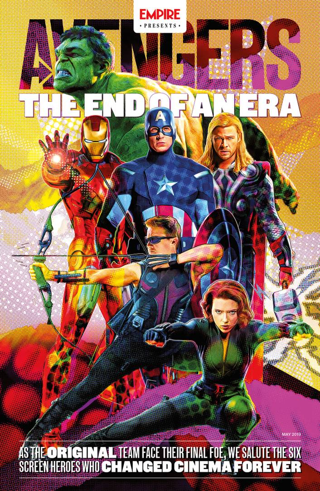

# My Review

#### Marvel has always been a huge part of my childhood ever since I watched Iron Man in theatres for the first time in 2008, it sparked my interest in the Marvel Cinematic Universe and I would never have imagined that it would be where it is now. 11 years, 23 Movies, as the years went by I started loving the characters I was seeing on screen and it made me become a true fan of Marvel

#### Avengers Endgame was an extremely emotional and well developed film. There were times where I laughed, times where I cried, times where I celebrated with the rest of the crowd in the theatre and it was truly an amazing experience. My favourite part of the movie was that the Russo brothers were willing to give ample amounts of screen time to the characters, especially the original 6, to see how they have developed after 11 years. This film may not have had that much action on screen like Infinity War did but it had a lot of character development which I appreciated greatly, we were able to see these characters from a different perspective and understand how far they’ve come, instead of just throwing them into battle which would probably be awesome too. 

#### I’d say that this movie is truly a movie for the fans, long time marvel lovers and fans will be able to identify the many Easter eggs from the comics and past films. I want to thank the Russo brothers for producing a true spectacle , one that will be remembered and enjoyed for many years to come. 

#### I usually enjoy watching other people's reviews online and seeing what else they have to say about movies that I enjoyed. Maybe there were some details that I missed, or some ideas that I never really thought of before watching other movie reviews. The link I provided is just one review from a channel that I enjoy watching. [Endgame Review.](https://www.youtube.com/watch?v=HGqDAVHul7Q "Endgame Review.")

#### Back to home page >>> [Home Page](https://aduenas5.github.io/ "Home Page") <<<
